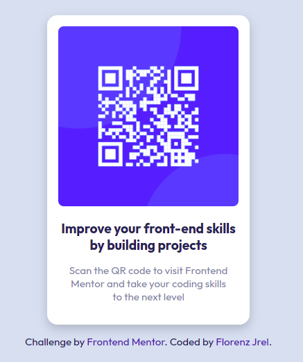

# qr-code-frontendmentor
# Frontend Mentor - QR code component solution

This is a solution to the [QR code component challenge on Frontend Mentor](https://www.frontendmentor.io/challenges/qr-code-component-iux_sIO_H). Frontend Mentor challenges help you improve your coding skills by building realistic projects. 

## Table of contents

- [Overview](#overview)
  - [Screenshot](#screenshot)
  - [Links](#links)
- [My process](#my-process)
  - [Built with](#built-with)
  - [What I learned](#what-i-learned)
  - [Continued development](#continued-development)
- [Author](#author)
- [Acknowledgments](#acknowledgments)

## Overview

### Screenshot



### Links

- Solution URL: [https://github.com/florenzjrel/qr-code-frontendmentor](https://github.com/florenzjrel/qr-code-frontendmentor)
- Live Site URL: [https://florenzjrel.github.io/qr-code-frontendmentor/](https://florenzjrel.github.io/qr-code-frontendmentor/)

## My process

### Built with

- Semantic HTML5 markup
- Basic CSS

### What I learned

Some of my major learnings while working through this project are: how important it is to use semantic HTML elements for accessibility, gained new understanding of BEM methodology, how it would be much easier to put the padding in the body instead of the main element or the card for this specific project. I also want to emphasize how significant researching while doing a project because we need to accept in on ourselves that we don't know everything. Keep on learning!

Code snippets that I'm proud of:

```html
<main>
    
    <p class="card--title">Improve your front-end skills by building projects</p>
    <p class="card--description">Scan the QR code to visit Frontend Mentor and take your coding skills to the next level</p>
</main>
```
```css
body {
  padding-top: 2em;
}
```

### Continued development

In future projects, I would like to continue focusing on areas that I am not yet comfortable using because I need to understand it deeply. Those areas are CSS Flexbox, CSS Grid and the BEM methodology. I find them very useful and I want to refine it so that I can use it for future projects easily. I will also update this README file in the near future.

## Author

- Frontend Mentor - [@florenzjrel](https://www.frontendmentor.io/profile/florenzjrel)

## Acknowledgments

I would like to give thanks to Jevinson Lim, who helped me out on the final touches of this project and for giving me awesome tips and insights.
